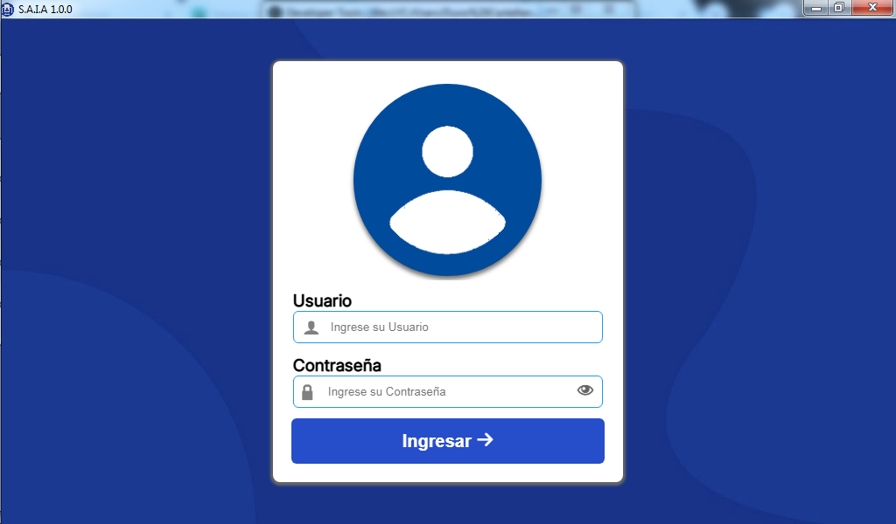
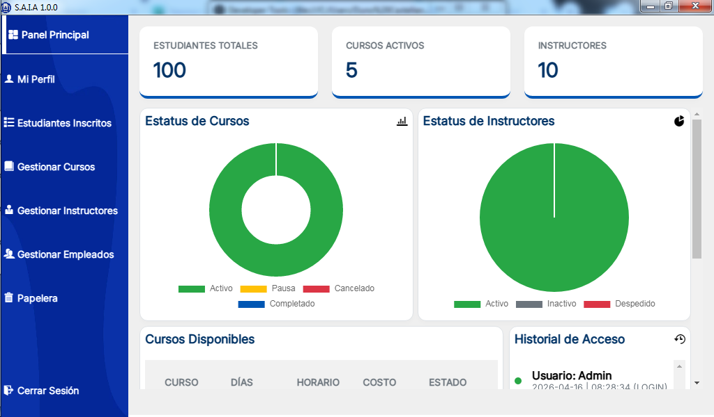
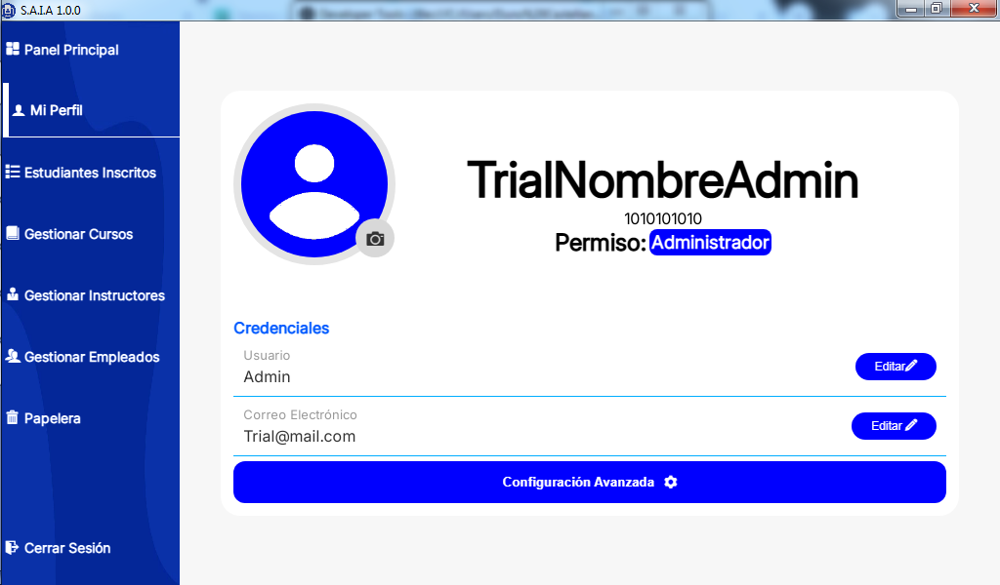
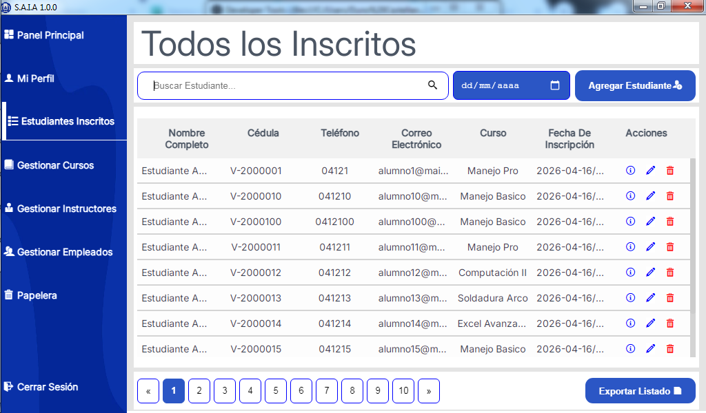
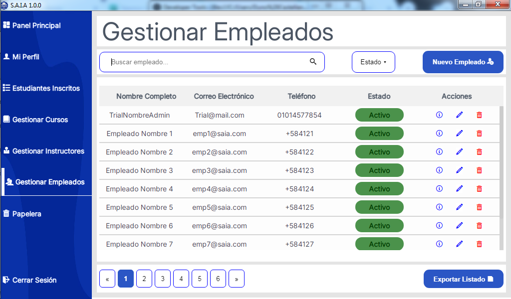
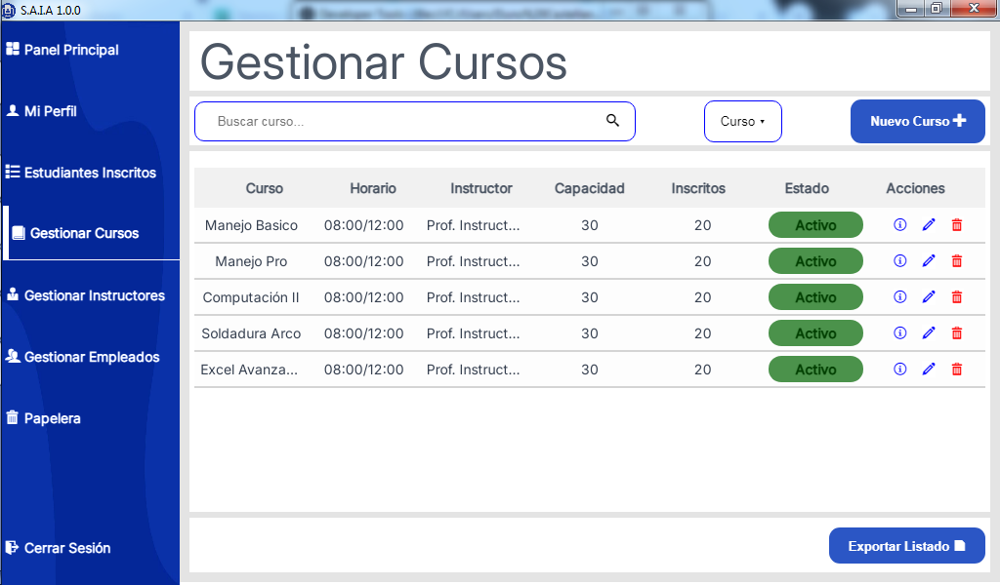
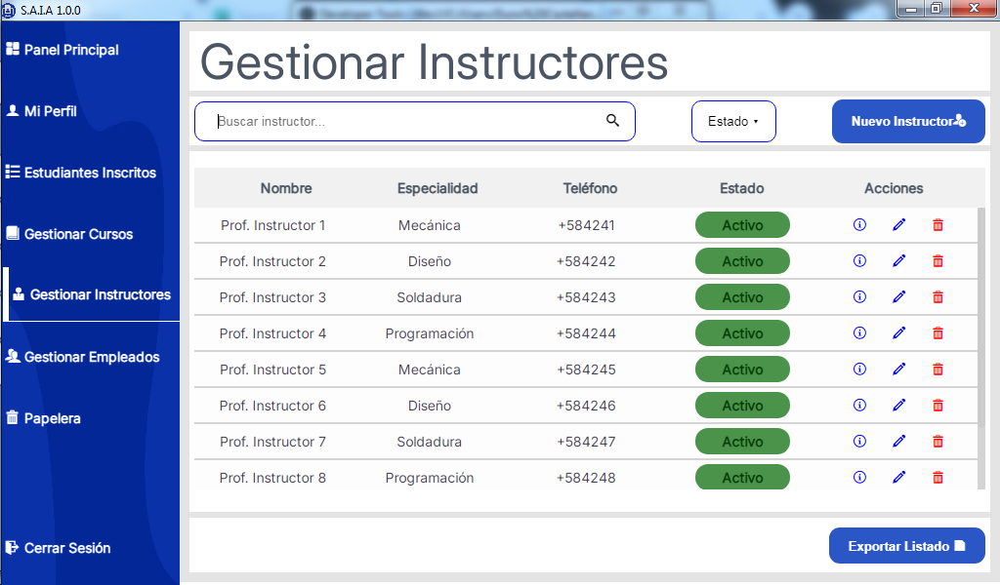

# S.A.I.A v1

Es una plataforma integral diseñada para optimizar y simplificar la administración de instituciones educativas, centros de capacitación y academias. El sistema centraliza el control académico y administrativo, permitiendo una gestión eficiente de los recursos humanos y educativos.

## 🚀 Funcionalidades Principales

La aplicación se divide en módulos clave para cubrir todas las necesidades de una institución:

### 1. Gestión de Cursos 📑
* **Creación y Organización:** Configura programas de estudio, niveles, categorías y horarios.
* **Control Académico:** Seguimiento detallado del progreso de los cursos y asignación de recursos.

### 2. Registro y Control de Perfiles 👥
El sistema permite el registro y administración de tres tipos de usuarios fundamentales:
* **Estudiantes:** Gestión de matrículas, datos personales, historial académico y seguimiento de inscripciones.
* **Instructores:** Registro del cuerpo docente, asignación de materias, perfiles de especialidad y horarios.
* **Empleados:** Administración del personal operativo y de soporte que gestiona la institución.

## Images

## Links

You may be using [S.A.I.A](https://github.com/Code-Quartet/S.A.I.A.git).

